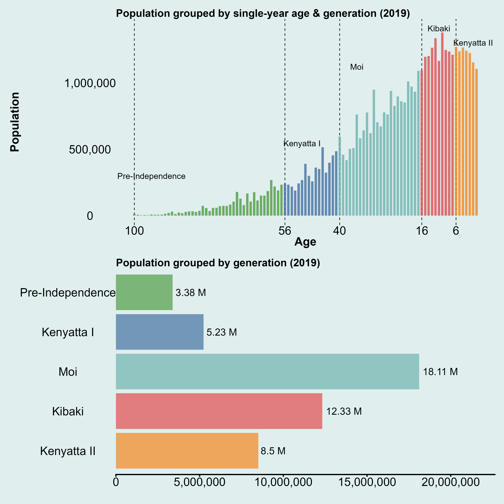
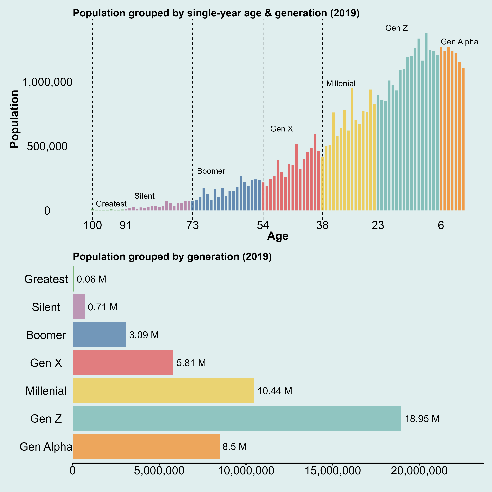
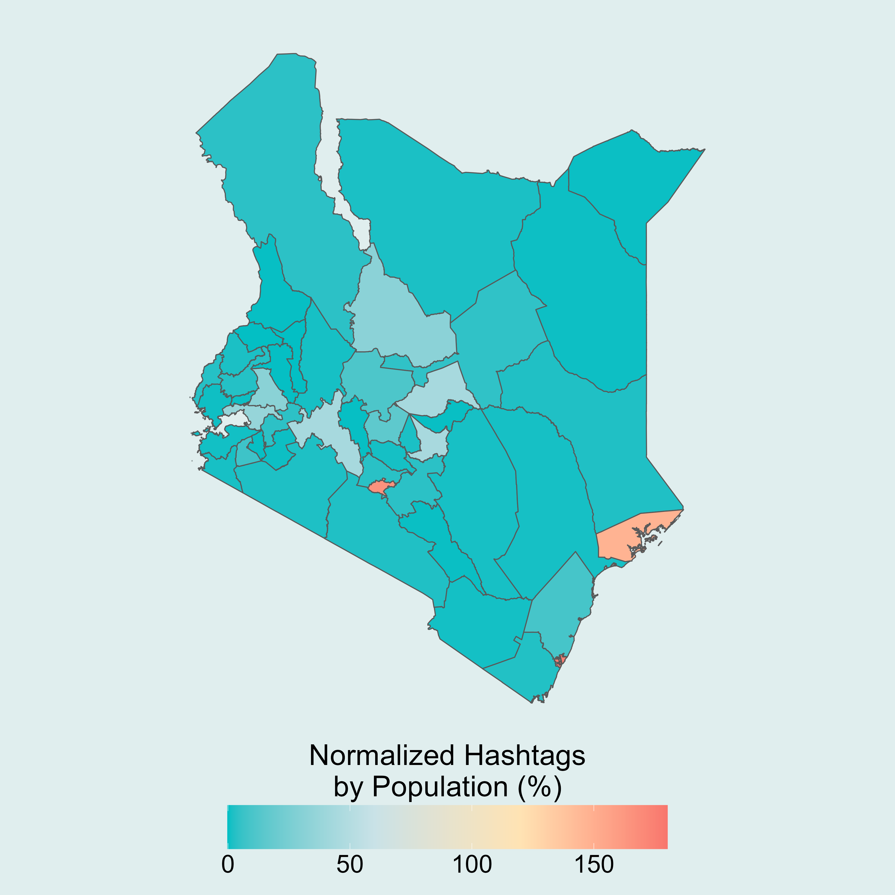
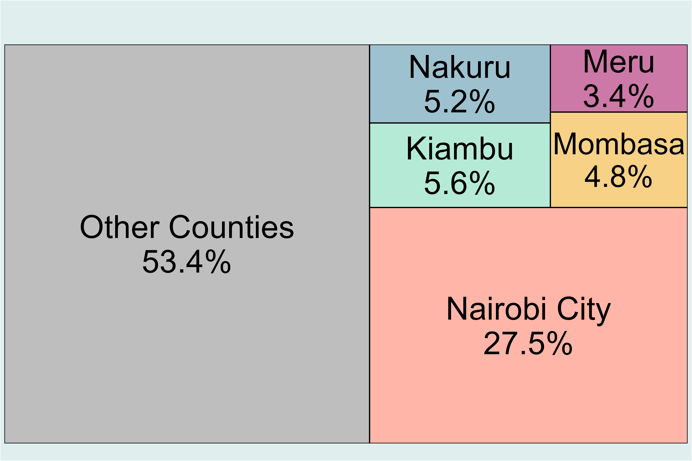
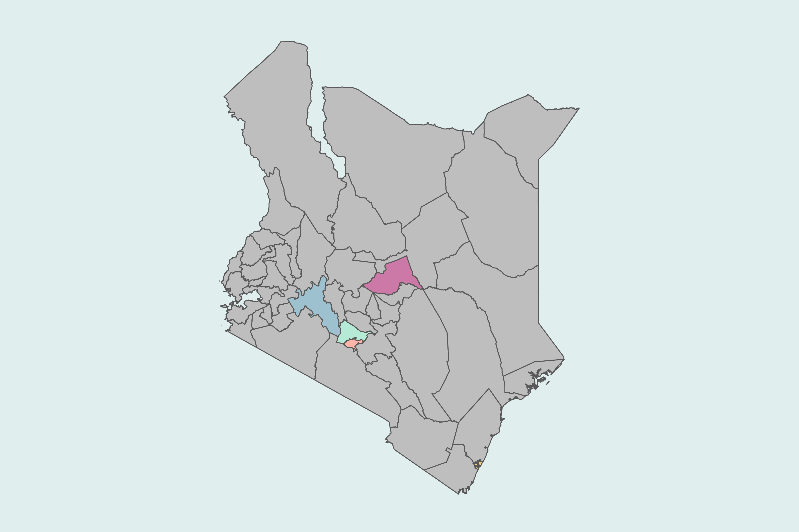

# Kenya Census (2019) Data Visualization

Welcome to the Kenyan Census Data Visualization repository! 
This repository contains code and data related to the Kenyan Census (2019).
The goal of this project is to generate insightful visualizations and make them more accessible to researchers, policymakers, and the general public..

### All data are obtained from:
1) 2019 Kenya Population and Housing Census
2) Shelmith Kariuki (2020). rKenyaCensus: 2019 Kenya Population and Housing Census Results. R package version 0.0.2.

***NOTE: Direct links to the code used to produce the image(s) below will be provided ASAP (if not provided already).***

**UPDATE: REPO IS BEING REARRANGED SO LINKS BELOW WILL NOT BE FUNCTIONAL UNTIL FURTHER NOTICE (05 June 2025)**

### Visualization 1 - Kenyan Generations by Presidential Era (2019)

[Code 1](sub_pro_2_pop_gen/r_scripts/national/knbs_pop_gen_presidency.R)
[Code 2](sub_pro_2_pop_gen/r_scripts/national/knbs_pop_gen_presidency_pyramid.R)

In this visualization, I look at the Total Kenyan Population by Generation. 
Here, Kenyans are classified into 5 generations (Pre-Independence, Kenyatta I, Moi, Kibaki, and Kenyatta II)

### Visualization 2 - Kenyan Generations by Universal Definition (2019)

[Code 1](sub_pro_2_pop_gen/r_scripts/national/knbs_pop_gen_universal.R)
[Code 2](sub_pro_2_pop_gen/r_scripts/national/knbs_pop_gen_universal_pyramid.R)

In this visualization, I look at the Total Kenyan Population by Generation. 
Here, Kenyans are classified into universal generations ()

### Notes
1) This project is inspired by [Jason Timm's](https://jtimm.net/posts/seven-generations/) work on American generations and is modified to the Kenyan context. 

### Visualization 3 - Instagram Hashtags normalized by Population (%)

[Code](sub_pro_4_kenya_infographics/r_scripts/hashtag_map_1.R)

In this visualization, we look at the number of Instagram hashtags normalized by population (%) in all of Kenya's 47 counties

### Visualization 4 - Top 5 County Economies in Kenya

[Code](sub_pro_5_kenya_gcp_2024_analysis/r_scripts/infographics_2a_county_econ_activity_1.R)

This visualization showcases the top 5 county economies in Kenya. The top 5 economies contribute to approximately half of Kenya's GDP.

